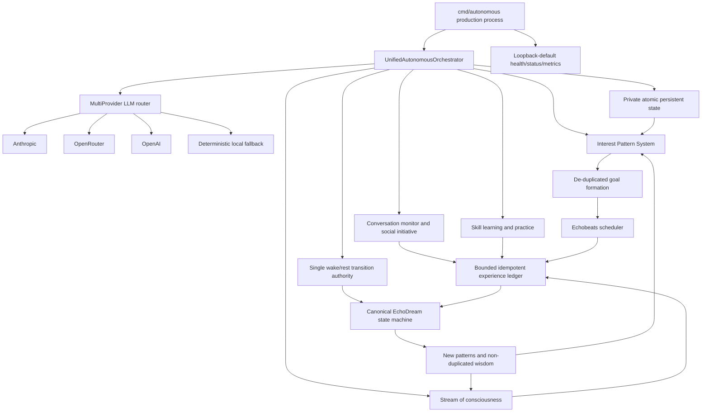
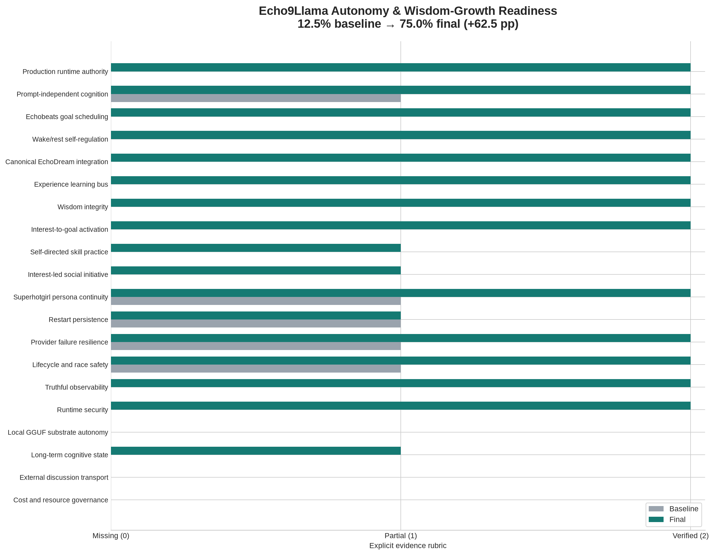

# Evolution Iteration — Unified Production Autonomy Loop

**Date:** 2026-08-11  
**Repository:** `cogpy/echo9llama`  
**Author:** Manus AI  
**Iteration focus:** Make the repository’s genuinely autonomous architecture the shipped runtime, then close the waking-experience → EchoDream → wisdom → waking-attention loop without claiming capabilities that remain unwired.

## Executive Summary

The previous iteration implemented a substantial `UnifiedAutonomousOrchestrator`, but the binary built from `./cmd/autonomous` still instantiated an older `AutonomousAgent`. The unified command itself was excluded from normal builds by a `//go:build ignore` directive. Consequently, the repository could compile while production omitted canonical EchoDream, interest-led goals, skill practice, discussion autonomy, truthful cognitive telemetry, and the intended unified wake/rest authority.[1] [2] [8]

This iteration promotes the unified orchestrator into the real production entry point and repairs the closed cognitive loop. Thoughts, goals, goal outcomes, discussion messages, skill outcomes, and waking wisdom now enter a bounded idempotent experience bus. The canonical `core/echodream.SleepWakeStateMachine` consolidates those experiences during rest, extracts new patterns, synthesizes non-duplicated wisdom, and reintegrates each insight once into waking interests and attention.[2] [3] Runtime lifecycle, provider fallback, persistence permissions, observability, and the Go toolchain were also hardened.

> This is a verified autonomy-loop improvement, **not a claim that Echo9Llama has achieved AGI, consciousness, or general wisdom**. Local GGUF inference, durable dream/event memory, externally connected discussions, and explicit resource governance remain incomplete.

## What Was Actually Broken

| Finding | Production consequence | Correction |
|---|---|---|
| The shipped command constructed the legacy autonomous agent. | The repository’s most complete autonomy architecture was not production code. | `./cmd/autonomous` now constructs `*deeptreeecho.UnifiedAutonomousOrchestrator`, with a command-level type regression.[1] [5] |
| The unified orchestrator owned a legacy dream adapter rather than canonical EchoDream. | Wake/rest claims did not produce the canonical consolidation and wisdom pipeline. | The orchestrator now owns `*echodream.SleepWakeStateMachine` directly.[2] [3] |
| Wake/rest state had competing authorities and incomplete callbacks. | Sleep could become one-way or disagree with orchestrator status. | `AutonomousWakeRestManager` is the single transition authority and drives rest, dream, and wake callbacks.[2] |
| Interest, skill, discussion, telemetry, and wisdom subsystems were constructed but never started. | Live production showed zero interests and zero autonomous goals. | All constructed subsystems start in dependency order, roll back on failure, and stop in reverse order.[2] |
| Goal review recreated the same interest goals repeatedly. | Activating interests would have produced unbounded duplicate goals. | Active goal descriptions are de-duplicated before enqueueing.[2] |
| Historical dream patterns were synthesized again on empty later cycles. | Wisdom totals inflated without new evidence. | A bounded synthesis cursor permits only newly extracted patterns to create new wisdom.[3] |
| Cognitive accessors exposed nested mutable slices. | Asynchronous dream ingestion could race with thought, conversation, and skill mutation. | Accessors now return defensive deep snapshots; race regressions cover the boundary.[2] [4] |
| Remote providers were the only fallback when keys existed. | An upstream outage could stop autonomous cognition despite a deterministic local fallback implementation. | Remote providers retain priority, while `SimpleFallbackProvider` is always the final substrate and honors cancellation.[6] |
| Persistent consciousness files used `0755/0644` and a predictable temporary filename. | Thoughts, goals, and identity state could be readable by other local users or exposed to fixed-temp-file attacks. | State uses `0700/0600`, unpredictable temporary files, flush-before-rename, and atomic replacement.[7] |
| The pinned Go 1.24.7 standard library and four reachable module versions were vulnerable. | Production HTTP/TLS/provider and legacy repository paths inherited known defects. | Go is pinned to 1.25.12; gRPC, quic-go, x/image, and x/crypto were raised to fixed releases; full `govulncheck ./...` reports zero reachable vulnerabilities.[9] |
| CI used a Go-1.24-built linter, a v1 lint schema, commandless Dgraph images, and stale mutating E2E endpoints. | Lint could not start, Dgraph containers exited immediately, and E2E did not describe the promoted read-only runtime. | CI now pins current actions and golangci-lint v2.12.2, uses a migrated v2 schema with a no-new-production-issues gate, runs the official Dgraph standalone development image, and tests real health/status/metrics behavior.[11] [12] [13] |
| Dgraph `CommitNow` mutations were committed a second time by the wrapper. | Real CRUD, graph, hypergraph, and bulk integration tests reported `Transaction has already been committed or discarded`. | The wrapper returns after Dgraph's atomic commit and commits explicitly only when `CommitNow` is false; the full Dgraph integration suite now passes.[13] [14] |
| The autonomous container still built on Go 1.24 and declared credential placeholders in image layers. | The Go-1.25 module could not build in Docker, and image scanning flagged secret-bearing `ENV` instructions. | The builder is pinned to `golang:1.25.12-alpine`, credentials are runtime-only, and the build context excludes local models and generated binaries.[15] |
| Full-repository gosec SARIF contained locationless legacy findings. | GitHub accepted the upload but could not process it for Code Scanning. | Gosec v2.28.0 scans the supported production scope, every result has an artifact location, and CodeQL Action v4 uploads successfully.[13] [14] |
| The OpenCog integration test built the production 1,024-unit reservoir under race/coverage and tied system lifetime to a 10-second operation deadline. | Loaded Linux and macOS runners could time out even though the production code was healthy. | An internal sized constructor preserves the 1,024-unit production default while the test builds a 128-unit fixture and separates lifecycle cancellation from the input deadline; both OS unit jobs now pass consistently.[14] |

## Resulting Production Architecture



The architecture now has one production composition root, one wake/rest authority, one canonical dream engine, and one bounded experience-ingestion boundary. The experience ledger is limited to 5,000 source keys; nested thought, conversation, skill, dream-pattern, knowledge, and wisdom slices are copied before crossing concurrency boundaries.[2] [3] [4]

## Closed Cognitive Loop

| Stage | Implemented behavior | Evidence |
|---|---|---|
| **Wake** | The orchestrator starts interests, skills, discussions, telemetry, wisdom, stream-of-consciousness, Echobeats, and wake/rest management in dependency order. | Lifecycle tests and live startup logs.[2] [4] |
| **Attend** | Ten core interests seed attention; learned interests are restored without being overwritten. | Interest persistence regression.[4] |
| **Choose** | Top interests generate five goal directions; later reviews generate zero duplicates while goals remain active. | Final live simulation: `goals=5`; subsequent reviews logged `Generated 0 new goals`.[2] |
| **Experience** | Thoughts, goal creation/outcomes, messages, practice outcomes, and waking reflection enter EchoDream exactly once. | Experience-source and ledger-bound regressions.[4] |
| **Rest** | Configurable fatigue/duration policy pauses waking cognition and enters canonical EchoDream. Evaluation cadence scales to configured durations. | Three rest and three dream transitions in the bounded live process.[2] |
| **Integrate** | EchoDream consolidates experiences, extracts only new patterns, creates bounded wisdom, and clears pending experience input. | EchoDream regressions and final live status: `pending_experiences=0`, `dream_wisdom=3`.[3] |
| **Wake wiser** | Each dream insight is reintegrated exactly once into wisdom depth, interests, discussion salience, and stream attention. | Wake round-trip and idempotent integration tests.[4] |
| **Remember** | Cycles, thoughts, goals, wisdom totals, cognitive load, wake/rest state, and learned interests survive process restart. | Restart check restored 48 cycles, one thought, three wisdom insights, and the active interest map.[2] [7] |

## Production Runtime

The autonomous process is now the normal command:

```bash
export ANTHROPIC_API_KEY=...
export OPENROUTER_API_KEY=...
export ECHO_STATE_DIRECTORY="$HOME/.echo9llama/state"

go run ./cmd/autonomous
```

The process binds observability to `127.0.0.1:8080` by default. A container or remote deployment must opt in explicitly with `ECHO_HTTP_ADDR=0.0.0.0`. The available endpoints are read-only:

```bash
curl http://127.0.0.1:8080/health
curl http://127.0.0.1:8080/status
curl http://127.0.0.1:8080/metrics
```

| Environment variable | Purpose | Default |
|---|---|---|
| `ECHO_SESSION_NAME` | Stable name for the current process session | Timestamped session name |
| `ECHO_IDENTITY` | Identity context used by cognitive subsystems | Wisdom-cultivating Echo identity |
| `ECHO_PERSONA` | Bounded persona context | Magnetic confidence, playful wit, brilliance, and underlying wisdom |
| `ECHO_STATE_DIRECTORY` | Private persistent-state directory | `./echo_state` |
| `ECHO_MAIN_LOOP_INTERVAL` | Main orchestration cadence | `5s` |
| `ECHO_THOUGHT_INTERVAL` | Autonomous thought cadence | `10s` |
| `ECHO_GOAL_REVIEW_INTERVAL` | Interest-to-goal review cadence | `1m` |
| `ECHO_WISDOM_INTERVAL` | Waking reflection cadence | `10m` |
| `ECHO_STATE_SYNC_INTERVAL` | Durable-state sync cadence | `2m` |
| `ECHO_WAKE_DURATION` | Maximum configured waking period | `4h` |
| `ECHO_REST_DURATION` | Maximum configured rest period | `30m` |
| `ECHO_DREAM_LIGHT_DURATION` | EchoDream light phase | `2m` |
| `ECHO_DREAM_DEEP_DURATION` | EchoDream consolidation phase | `5m` |
| `ECHO_DREAM_REM_DURATION` | EchoDream pattern/wisdom phase | `3m` |
| `ECHO_HTTP_ADDR` | Observability bind address | `127.0.0.1` |
| `PORT` | Observability port | `8080` |

## Verification Evidence

The final bounded live run used the activated Anthropic and OpenRouter credentials, retained the deterministic fallback, and received no external prompt after process start. It completed normally with `runtime_exit=0` and no provider errors.

| Live measure | Observed result |
|---|---:|
| Main autonomous cycles | 48 |
| Provider-backed autonomous thoughts | 1 |
| Interest-derived goals | 5 |
| Rest transitions | 3 |
| Dream transitions | 3 |
| Wake transitions | 4 |
| Canonical dream wisdom insights | 3 |
| Reintegrated wisdom total | 3 |
| Wisdom depth | 1.943 |
| Pending dream experiences at final snapshot | 0 |
| Credential leaks across logs, state, status, and diff | 0 |
| State directory/file permissions | `0700` / `0600` |

The live thought retained the intended surface persona—playful confidence and expressive stage direction—while reflecting on existence and cognition. The persona remains a bounded communication characteristic inside the identity context rather than a substitute for epistemic validation.[1] [2]

| Validation | Result |
|---|---|
| `CGO_ENABLED=0 go build ./...` | Pass |
| `go test ./core/... ./cmd/...` | Pass |
| `go test -race -count=1 ./cmd/autonomous ./core/deeptreeecho ./core/echodream ./core/llm` | Pass |
| `go vet ./core/... ./cmd/...` | Pass |
| `govulncheck ./...` | **0 reachable vulnerabilities across the full repository** |
| `golangci-lint v2.12.2 --new-from-rev=HEAD~1 ./core/... ./cmd/...` | Pass; zero new production issues |
| `actionlint .github/workflows/ci.yaml` | Pass |
| Integration suite with `-tags=integration` | Compiles; Dgraph runtime is supplied by official standalone CI service |
| Real-process E2E suite with `-tags=e2e` | Pass against health, status, metrics, autonomous cycles, help, and 404 contracts |
| Remote comprehensive CI run `31491322692` | **Pass on the exact final code revision**: tidy, lint, Linux/macOS builds and race/coverage unit tests, full govulncheck, gosec SARIF upload, benchmarks, Dgraph integration, Docker build, and real-process E2E.[14] |
| Remote CodeQL run `31488198353` | **Pass** across Actions, C/C++, C#, Go, JavaScript/TypeScript, and Python analyses.[16] |
| Production restart with prior state | Restored counters and learned interests; graceful exit |
| `go mod tidy` cleanliness | Repaired; stale unused module entries removed |

The remote workflows were treated as additional experiments rather than ceremonial checks. The first pass exposed 11 reachable module vulnerabilities, the linter/toolchain mismatch, the v1 lint configuration, commandless Dgraph service images, port contention, and stale E2E assumptions. The second pass confirmed those repairs and exposed the deeper Dgraph double-commit, Go-1.24 Docker builder, and locationless SARIF defects. A later documentation-only rerun exposed the OpenCog race/coverage fixture's load-sensitive deadline. After bounded correction and exact local reproduction, comprehensive run `31491322692` passed every job on the final code revision, while CodeQL completed all six language analyses successfully.[9] [11] [12] [13] [14] [16]

Repository-wide `go test -run '^$' ./...` still exposes stale upstream/merge-era test surfaces outside this intervention, especially in `examples`, `sample`, and `server`. The normal non-CGO product build, supported production lint gate, integration compilation, and real-process E2E contract are green. The remaining stale packages are documented rather than hidden and should be repaired as a dedicated compatibility iteration.

## Measured Readiness Change

The score below uses a strict iteration rubric: `0 = missing`, `1 = present but partial or not demonstrated end to end`, and `2 = verified end to end`. It measures **repository readiness for the stated architecture**, not intelligence or consciousness.



| Measure | Baseline | Final |
|---|---:|---:|
| Verified-readiness points | 5/40 | 30/40 |
| Readiness percentage | 12.5% | 75.0% |
| Absolute change | — | +25 points / +62.5 percentage points |

The largest verified gains are production authority, canonical EchoDream, bounded experience flow, interest-to-goal activation, lifecycle safety, truthful observability, and runtime security. The final 25% remains intentionally unclaimed.

## Explicit Non-Claims and Remaining Gaps

| Capability | Current truth | Consequence |
|---|---|---|
| **Local GGUF autonomous provider** | The canonical router’s GGUF provider remains disabled. | Provider continuity is deterministic but not model-capable when all remote providers fail. |
| **Full cognitive event persistence** | Counters and interests persist; stream events, goal queue, dream knowledge/patterns, skills, and discussions do not. | Restart continuity is real but incomplete. |
| **External discussion transport** | Interest-led discussion decisions are internal only. | Echo cannot yet initiate or respond over Slack, mail, or chat transports from this runtime. |
| **Tool-grounded skill mastery** | Skill practice and outcomes exist, but most practices are LLM-evaluated rather than tool-verified. | Learning can describe improvement without proving executable competence. |
| **Cost/resource governance** | Timing limits activity; token, currency, power, memory, and concurrency budgets are absent. | Persistent deployment needs an explicit resource envelope. |
| **Long-horizon wisdom validation** | Wisdom is pattern-derived and de-duplicated, but not yet challenged by counterexamples or outcomes over weeks. | Insight quantity and depth are not equivalent to durable practical wisdom. |

## Next Iteration Priorities

The next bounded intervention should be **capability-aware local inference**, ported selectively from the evolved `o9nn/echo.go` lineage rather than reimplemented. Commits `2e9cf49e`, `afe41f22`, `0cae7698`, `cb7693ad`, and `5a10fda4` contain backend capability discovery, host/model fit, local GGUF provider, model registry, and runtime policy work that can be adapted behind the existing `llm.LLMProvider` interface.[10]

| Priority | Next center | Acceptance condition |
|---:|---|---|
| 1 | Capability-aware `LocalGGUFProvider` | `Available`, `MaxTokens`, `Generate`, and `StreamGenerate` work with build-tag-safe stubs; Echobeats selects it only when host/model fit passes. |
| 2 | Append-only cognitive event store | Thoughts, goals, outcomes, discussions, skills, dreams, and wisdom have versioned provenance and deterministic replay across restarts. |
| 3 | Resource-governed Echobeats | Per-provider token/cost budgets, concurrency limits, backpressure, and degraded-mode policies are observable and tested. |
| 4 | Tool-grounded skill curricula | Practice produces artifacts and objective evaluator results, which EchoDream consolidates into skill memory. |
| 5 | Consent-aware social adapters | Channel-neutral ingress/egress supports start, continue, end, and reply decisions without unsolicited external posting. |
| 6 | Remaining repository compatibility repair | `go test -run '^$' ./...` is green after repairing stale `examples`, `sample`, and `server` surfaces under the pinned toolchain. |

## References

[1]: [Production autonomous command](../../cmd/autonomous/main_production.go)
[2]: [Unified autonomous orchestrator](../../core/deeptreeecho/unified_autonomous_orchestrator.go)
[3]: [Canonical EchoDream state machine](../../core/echodream/sleep_wake_state_machine.go)
[4]: [Unified production lifecycle and experience regressions](../../core/deeptreeecho/unified_autonomous_orchestrator_production_test.go)
[5]: [Production command regressions](../../cmd/autonomous/main_production_test.go)
[6]: [Provider failure-recovery regressions](../../core/llm/multi_provider_recovery_test.go)
[7]: [Persistent-state security regression](../../core/deeptreeecho/persistent_consciousness_state_security_test.go)
[8]: [Previous iteration: Closing the Autonomy Loop](EVOLUTION_ITERATION_2026-07-11_CLOSING_THE_AUTONOMY_LOOP.md)
[9]: [Go vulnerability management — `govulncheck`](https://pkg.go.dev/golang.org/x/vuln/cmd/govulncheck)
[10]: [`o9nn/echo.go` backend-autonomy lineage](https://github.com/o9nn/echo.go/commits/main)
[11]: [Dgraph basic single-host container setup](https://docs.dgraph.io/v25.1/installation/single-host-setup)
[12]: [golangci-lint v1-to-v2 migration guide](https://golangci-lint.run/docs/product/migration-guide/)
[13]: [Comprehensive CI workflow](../../.github/workflows/ci.yaml)
[14]: [Successful comprehensive CI run 31491322692](https://github.com/cogpy/echo9llama/actions/runs/31491322692)
[15]: [Docker Hub `golang:1.25.12-alpine` tag](https://hub.docker.com/v2/repositories/library/golang/tags/1.25.12-alpine)
[16]: [Successful CodeQL run 31488198353](https://github.com/cogpy/echo9llama/actions/runs/31488198353)
