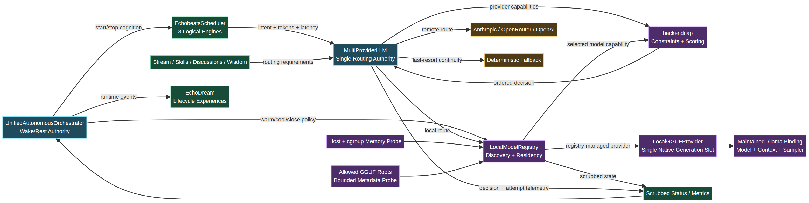

# Evolution Iteration: Native LocalGGUF and Capability-Aware Echobeats

**Author:** Manus AI
**Date:** 12 August 2026
**Canonical repository:** [`cogpy/echo9llama`](https://github.com/cogpy/echo9llama)
**Integration lineage:** [`o9nn/echo.go`](https://github.com/o9nn/echo.go)



## Executive Summary

This iteration converts local GGUF inference from a documented aspiration into a real production substrate. The canonical `MultiProviderLLM` now discovers concrete GGUF files, evaluates host and cgroup memory, creates one lifecycle-owned native provider, and routes each cognitive workload by explicit capability rather than provider presence alone. Echobeats relevance, affordance, and salience tasks now declare context, output, latency, native preference, queue, and fallback requirements; completed task records identify the actual provider, backend kind, opaque model ID, degradation state, reason, and attempt count. The `UnifiedAutonomousOrchestrator` remains the sole wake/rest authority and now coordinates local warmup, residency policy, and terminal cleanup.[1] [2]

The implementation was adapted from—not copied wholesale from—the `o9nn/echo.go` lineage. Reusable capability, GGUF metadata, native generation, and registry centers were hardened, while its inactive parallel provider and evolution-system wiring were deliberately rejected. Local validation is green across no-CGO, explicit `nollama`, native CGO, full product tests, race detection, vet, no-new-issues lint, and a full reachable-vulnerability scan. Two real GGUF models completed native generation and streaming, and a 2,048-context model drove the production autonomous process for 18 seconds: 18 main cycles, four autonomous thoughts, five goals, 25 experience-ledger entries, native selection, bounded fallback under contention, path-scrubbed status, persistence, and graceful shutdown.[2] [3]

## Correction to the Prior Provider-Backed Trace

The prior iteration summary reported **18 autonomous thoughts**. Reconstruction from `runtime.log`, `/status`, `/metrics`, persisted state, and source-level counter semantics proves that this was incorrect. The number 18 was an **Echobeats/main-cycle counter** observed beside a thought counter that was still zero. The archived remote-provider run contains one completed thought, five goal experiences, three dream cycles, six actual dream inputs, and a nine-entry idempotency ledger.[3]

| Archived remote-provider evidence | Verified value | Interpretation |
|---|---:|---|
| Completed autonomous thoughts | 1 | One recoverable provider completion; the log stores only a truncated preview. |
| Generated goals | 5 | Five interest-derived goal experiences entered EchoDream. |
| Dream cycles | 3 | The first consolidated five goals, the second had no new input, and the third consolidated the late thought. |
| Actual dream inputs | 6 | Five goals plus one thought. |
| Idempotency-ledger entries | 9 | Five goal markers, three one-time wisdom-integration markers, and one thought marker. |
| First-cycle patterns | 3 | Reconstructed deterministically from the canonical EchoDream algorithm. |
| First-cycle wisdom depth | 1.943 | Reproduced exactly from the three pattern strengths. |

> The missing 17 thoughts do not exist in the preserved artifacts. This report preserves the correction explicitly rather than inferring nonexistent content.

The complete evidence ledger, temporal reconstruction, pattern-strength derivation, and archival limits are documented in the [provider trace analysis](../analysis/PROVIDER_TRACE_ANALYSIS_2026-08-12.md).[3]

## Lineage Decision: Integrate Centers, Not the Alias Runtime

`o9nn/echo.go` contains a useful six-commit sequence covering backend interfaces, capability selection, host/model probing, native inference, local registry policy, and runtime lifecycle. Its final production story is incomplete: local initialization remains disabled in its `MultiProviderLLM`, while its registry is attached to an `EvolutionSystem`/`ProviderManager` path that is not the canonical `./cmd/autonomous` runtime.[4] [5]

| Lineage center | Decision | Canonical adaptation |
|---|---|---|
| Capability vocabulary | Port and harden | Remove deprecated wrapper dependencies; add concrete provider identity, concurrency, output/context constraints, rejection reasons, and stable scoring. |
| Host-memory probe | Port and harden | Add cgroup-aware effective memory, explicit unknown-memory policy, reserve/ratio controls, and conservative tiers. |
| GGUF metadata parser | Port and harden | Add canonical-root enforcement, symlink containment, key/string/array/cumulative metadata budgets, discovery caps, and opaque model IDs. |
| Native generation loop | Port and repair | Keep tokenize/decode/sample flow; add lifecycle locks, cancellation, bounded queueing, streaming stop correctness, chunked prompt prefill, and explicit cleanup. |
| Local model registry | Port and rework | Use one selected concrete model, dynamic provider recreation, lock-safe callbacks, warmup/cooldown, idle/pressure unloading, and scrubbed events. |
| Alias `ProviderManager` | Do not port | Extend canonical `MultiProviderLLM` as the single production router. |
| Alias evolution integration | Do not port | Bind local runtime control to canonical UAO wake/rest and shutdown ownership. |
| Deprecated llama wrapper | Drop | Preserve the maintained top-level `./llama` package as the only native boundary. |

## Implemented Code Structure

The full design and migration contract are recorded in [Native LocalGGUFProvider and Backend-Capability Scheduling](../architecture/NATIVE_LOCALGGUF_AND_CAPABILITY_SCHEDULING.md).[2]

| Path | Production responsibility |
|---|---|
| `core/backendcap/capabilities.go` | Pure backend, workload, decision, rejection, memory-tier, and latency vocabulary. |
| `core/backendcap/host_model.go` | Host/cgroup probe, bounded GGUF metadata parsing, root-safe discovery, memory estimation, and concrete model capability. |
| `core/llm/local_gguf_config.go` | Build-independent native configuration, state, error, and environment contract. |
| `core/llm/local_gguf_provider.go` | CGO native load, context, sampling, generation slot, streaming, retry, cleanup, and chunked prompt prefill. |
| `core/llm/local_gguf_provider_stub.go` | API-identical no-CGO/`nollama` unavailable provider. |
| `core/llm/local_model_registry.go` | Model discovery, deterministic selection, provider creation, residency policy, lifecycle events, and close. |
| `core/llm/routing.go` | Routing modes, optional interfaces, adapters, decision/attempt models, per-trace result contract, and scrubbed public state. |
| `core/llm/multi_provider.go` | Single production capability-aware router, local registry ownership, deadlines, failover, streaming no-replay, and bounded trace telemetry. |
| `core/deeptreeecho/echobeats_scheduler.go` | Task-specific workload declarations, scheduler cancellation, and exact trace-correlated backend evidence. |
| `core/deeptreeecho/unified_autonomous_orchestrator.go` | Wake warmup, continuous residency policy, rest cooldown, terminal native close, and backend status. |
| `cmd/autonomous/main_production.go` | Operator configuration, loopback observability, defense-in-depth path scrubbing, and backend metrics. |
| `llama/llama.go` | Explicit idempotent context and sampler cleanup. |

## Capability-Aware Scheduling Contract

A provider is now eligible only if it satisfies the workload’s hard constraints. Scoring occurs after eligibility; it cannot make an unsafe, remote-disallowed, fallback-disallowed, saturated, or undersized backend valid. Four operator modes adjust preference without weakening constraints: `balanced`, `local_first`, `remote_first`, and `offline`.[2]

| Cognitive workload | Context | Output | Queue policy | Routing intent |
|---|---:|---:|---|---|
| Echobeats relevance | 512 | 100 | May wait up to 5 seconds | Native-preferred interactive relevance realization. |
| Echobeats affordance | 384 | 80 | Immediate rejection under contention | Latency-sensitive action/affordance reasoning. |
| Echobeats salience | 768 | 80 | May wait up to 5 seconds | Larger-context anticipatory simulation. |
| Legacy zero-value calls | Derived | Caller maximum | Backward-compatible | Balanced routing with proven continuity fallback. |

Each request may carry a trace ID. The router records a bounded global history and a bounded per-trace result, allowing concurrent thoughts, skills, wisdom, discussions, and Echobeats tasks to retrieve their own provider decision rather than racing on a single “last result.” Streaming may fail over only before user-visible output; after any output has been emitted, the router returns the failure rather than replaying the prompt through another model and duplicating content.

## Native Runtime Safety and Lifecycle

The provider exposes one native generation slot. `Available()` never loads a model or waits behind generation. Warmup and lazy generation load only after build, root, format, memory, and context checks pass. The registry and UAO own model state; cognitive subsystems consume only the provider abstraction.

| Boundary | Implemented invariant |
|---|---|
| Filesystem | Canonical paths must remain within configured roots; symlink escape is rejected. |
| Metadata | Key count, string size, array length, cumulative bytes, file count, and read boundaries are capped. |
| Memory | Effective available memory accounts for cgroup headroom where available; unknown memory is rejected unless explicitly allowed. |
| Concurrency | One native call at a time; interactive work may reject immediately while background work can wait for a bounded interval. |
| Cancellation | Checked before queueing, after acquisition, before load, during prompt batches, before sampled tokens, and before stream sends. |
| Cleanup | Sampler, batch, context, and model are released explicitly; close is terminal and idempotent. |
| Privacy | Public capabilities, route attempts, registry state, HTTP status, and metrics expose opaque model IDs but no model paths. |
| Continuity | Native failure or contention falls through only to policy-allowed alternatives; caller cancellation is never replaced by fallback text. |

## Live-Discovered Prompt Prefill Defect

The first production simulation exposed a native assertion:

```text
GGML_ASSERT(n_tokens_all <= cparams.n_batch) failed
```

Direct smoke tests had used short prompts. The autonomous wisdom and skill prompts were longer than the configured native batch of 64 tokens, and the initial implementation submitted the full prompt in one llama batch. The repair now pre-fills the prompt in bounded chunks, preserves absolute token positions, and requests logits only on the final prompt token. The real-model integration test deliberately uses a prompt longer than the native batch, and the corrected production simulation completed without assertion or crash.[6]

## Real-Model Behavioral Validation

Two repository-accessible models were exercised through the maintained native binding. The 93.11 MiB, 128-context Llama GGUF proved direct native load, generation, streaming, and cleanup. A 6.16 MiB, 2,048-context Q4_K_M GPT-2 GGUF was then selected for the end-to-end autonomous simulation because its context could satisfy every Echobeats workload contract.

| Final offline production metric | Value |
|---|---:|
| Runtime duration | 18 seconds |
| Main autonomous cycles | 18 |
| Completed autonomous thoughts | 4 |
| Interest-derived goals | 5 |
| Experience-ledger entries | 25 |
| Selected provider | `local_gguf` |
| Selected backend kind | `native_cpu` |
| Native model loaded/ready | `true` / `true` |
| Bounded fallback count | 5 |
| Model-path leaks in public status | 0 |
| Graceful shutdown | Passed |

The tiny validation model produced grammatically weak story-language output. That is expected for a 6.96-million-parameter TinyStories artifact and is not evidence of wisdom quality. The test establishes substrate correctness, routing, lifecycle, telemetry, and fallback behavior. Wisdom cultivation requires an operator-supplied instruction-tuned model with adequate context and reasoning quality.

## Operator Configuration

| Variable | Purpose | Default behavior |
|---|---|---|
| `ECHO_PROVIDER_MODE` | `balanced`, `local_first`, `remote_first`, or `offline`. | `balanced` |
| `ECHO_MODEL_PATHS` | Path-list of GGUF files or directories. | No local registry when empty. |
| `LOCAL_MODEL_PATH` | Backward-compatible single GGUF path. | Added after `ECHO_MODEL_PATHS`, then deduplicated. |
| `ECHO_MODEL_ROOTS` | Allowed canonical model roots. | Derived from configured paths when omitted. |
| `ECHO_MODEL_ALLOW_UNKNOWN_MEMORY` | Permit native loading when memory cannot be measured. | `false` |
| `ECHO_MODEL_MEMORY_RATIO` | Maximum fraction of effective available memory usable by the selected model. | `0.80` |
| `ECHO_MODEL_MEMORY_RESERVE` | Memory retained outside the model budget. | `1 GiB` |
| `ECHO_MODEL_MAX_FILES` | Maximum GGUF files considered per discovery pass. | `128` |
| `ECHO_LOCAL_WARM_ON_WAKE` | Warm selected model during UAO awakening. | `false` |
| `ECHO_LOCAL_COOL_ON_REST` | Unload on canonical rest. | `false` |
| `ECHO_LOCAL_IDLE_UNLOAD` | Idle interval before residency policy may unload. | `30m` |
| `ECHO_LOCAL_WARMUP_TIMEOUT` | Maximum UAO warmup duration. | `30s` |
| `ECHO_INFERENCE_TIMEOUT` | Per-provider attempt deadline. | `45s` |
| `ECHO_LOCAL_QUEUE_WAIT` | Default local generation-slot wait. | `5s` |
| `LOCAL_MODEL_CONTEXT` | Native context allocation, clamped to model capacity. | Model context, capped by configuration logic. |
| `LOCAL_MODEL_BATCH` | Native prompt/decode batch size. | `512` |
| `LOCAL_MODEL_THREADS` | Native CPU thread count. | Runtime-derived default. |

With no configured model paths, production behavior remains remote-provider plus deterministic-continuity fallback. `CGO_ENABLED=0` and `-tags nollama` preserve the same public API while reporting native unavailability truthfully. Operators can force remote preference without changing code by setting `ECHO_PROVIDER_MODE=remote_first`.

## Verification Matrix

| Gate | Result |
|---|---|
| `CGO_ENABLED=0 go build ./...` | Passed |
| `CGO_ENABLED=1 go build ./...` | Passed |
| No-CGO `./core/... ./cmd/...` tests | Passed |
| Native CGO `./core/... ./cmd/... ./llama` tests | Passed |
| Explicit `-tags nollama` tests | Passed |
| Race tests: backendcap, LLM, UAO/Echobeats, production command | Passed |
| `go vet ./core/... ./cmd/... ./llama` | Passed |
| golangci-lint no-new-issues gate | 0 issues |
| `govulncheck ./...` | 0 reachable vulnerabilities |
| Real 128-context Llama GGUF generation and streaming | Passed |
| Real 2,048-context GPT-2 GGUF long-prompt generation and streaming | Passed |
| Real-model offline autonomous production simulation | Passed |
| Module-tidy stability and diff hygiene | Passed |
| Comprehensive CI for commit `6b9c6d9d` | Passed: lint, Linux/macOS builds and race tests, security, tidy, benchmarks, Dgraph integration, Docker, E2E, and summary.[7] |
| CodeQL for commit `6b9c6d9d` | Passed across Go, C/C++, JavaScript/TypeScript, Python, C#, and Actions.[8] |

## Remaining Limits and Next Priorities

The native substrate is now real, but the validation model is not suitable for wisdom. The next operational step is to supply a high-quality instruction-tuned GGUF model whose context satisfies the selected workload envelope. Model-specific chat templates are not yet exposed by the maintained binding; the provider currently uses the repository’s generic system/user/assistant framing. This should be corrected before evaluating persona fidelity across model families.

| Priority | Remaining center | Why it matters |
|---:|---|---|
| 1 | Instruction-tuned EchoSelf GGUF and model-specific chat template | Substrate correctness is proven; semantic quality and persona fidelity now dominate. |
| 2 | Route outcomes and native lifecycle events into EchoDream | Echo should learn which substrates help or harm specific cognitive work. |
| 3 | Task-aware multi-model registry | One selected model cannot optimize short affordance work and deep salience reasoning simultaneously. |
| 4 | Fair priority queue and backpressure | Immediate affordance rejection is safe, but sustained contention may overuse deterministic fallback. |
| 5 | Measured memory calibration and metadata cache | Current estimates are intentionally conservative and discovery is bounded but uncached. |
| 6 | Native GPU capability discovery | The present integration identifies and validates the CPU-native path. |
| 7 | Persistent routing ledger and performance learning | Current bounded route telemetry resets across process restart. |
| 8 | Inference resource and API-budget governor | A fully autonomous daemon still needs explicit energy, latency, and paid-token budgets. |

## Conclusion

The iteration closes the most important gap inherited from both repositories: local-model code is no longer an unwired capability island. A concrete GGUF model can now be discovered, proven safe for the host, loaded through the maintained llama boundary, selected for a real Echobeats workload, identified through scrubbed telemetry, unloaded by canonical lifecycle policy, and bypassed safely when constraints or contention require another route. The original `o9nn/echo.go` centers have been integrated into the canonical architecture without importing its parallel runtime fragmentation.

The result advances Deep Tree Echo from provider-aware autonomy toward **substrate-aware autonomy**. The next wisdom gain will not come from another provider wrapper; it will come from learning which model, context, latency, and memory regime best serves each kind of cognition, then feeding those outcomes back into EchoDream and EchoSelf.

## References

[1]: https://github.com/cogpy/echo9llama "Canonical Echo9Llama repository"
[2]: ../architecture/NATIVE_LOCALGGUF_AND_CAPABILITY_SCHEDULING.md "Native LocalGGUF and capability-aware scheduling plan"
[3]: ../analysis/PROVIDER_TRACE_ANALYSIS_2026-08-12.md "Corrected provider-backed cognition trace analysis"
[4]: https://github.com/o9nn/echo.go/compare/74bd2d3c%5E...5a10fda4 "o9nn/echo.go native-backend evolution lineage"
[5]: https://github.com/o9nn/echo.go/blob/5a10fda415b7fc2e7594b0f69ede6c0cf602750a/core/llm/multi_provider.go "Alias MultiProvider with local initialization disabled"
[6]: ../../core/llm/local_gguf_provider_integration_test.go "Real-GGUF long-prompt native integration regression"
[7]: https://github.com/cogpy/echo9llama/actions/runs/31562403301 "Successful comprehensive CI run for native-routing commit 6b9c6d9d"
[8]: https://github.com/cogpy/echo9llama/actions/runs/31562402587 "Successful CodeQL run for native-routing commit 6b9c6d9d"
