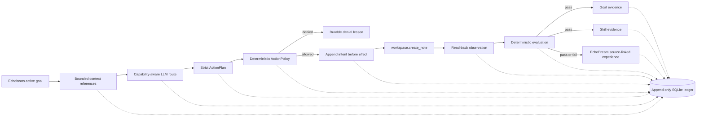

# Deep Tree Echo Evolution Iteration: Replay-Safe, Outcome-Grounded E1 Enaction

**Date:** 11 September 2026

**Author:** Manus AI

**Repository:** [`cogpy/echo9llama`](https://github.com/cogpy/echo9llama)

**Base commit:** `169f55b574f00f9efb4c6d061eeb1fc5b7e92024`

**Iteration designation:** `2026-09-11-replay-safe-e1-enaction`

## Executive result

This iteration closes the first trustworthy action-and-learning loop in the canonical `cmd/autonomous` runtime. Echobeats can now select an active goal during an affordance phase, request a strict structured plan through the capability-aware language-model router, pass the proposal through deterministic authority and advisory moral review, execute one confined create-only local tool, verify the exact observed effect, append the causal history to an immutable SQLite ledger, advance goal and skill state only from evaluator evidence, and send both success and failure outcomes into canonical EchoDream with source-event provenance.[1] [2] [3]

The production default remains **observe-only**. Filesystem actuation requires the explicit setting `ECHO_ENACTION_MODE=local-sandbox`. Even in that mode, the only available effect is creation of a bounded private Markdown note beneath `briefs/` in an owner-only workspace. No shell, network, messaging, external API mutation, Git mutation, deployment, self-modification, or arbitrary filesystem capability was added.

> **Accurate capability claim:** Deep Tree Echo now has one bounded form of autonomous, replay-safe, goal-directed local enaction with independently observed outcome evidence. It does not yet have general tool use, externally verified research, social autonomy, online model learning, or autonomous self-modification.

## Why this iteration was selected

A seven-repository comparative audit examined the target and related `ecco9`, `echo.go`, Home Echo, Echo Adventure, and echoself lineages. The target already contained a strong production orchestrator, capability-aware model routing, Echobeats, EchoDream, identity snapshots, skill structures, and moral-agency code. The highest-impact gap was causal rather than additive: goals and affordances produced language, but they did not produce a durable observed effect that could justify learning.

| Priority | Diagnosed problem | E1 disposition |
|---:|---|---|
| 1 | Echobeats affordance phases generated prose but performed no tool effect. | Replaced in production with a callback into the bounded enaction pipeline. |
| 2 | Action intent, effect, evaluation, and replay evidence were not durable. | Added a versioned append-only SQLite cognitive-event ledger. |
| 3 | Skill gains were derived from response length, time, and prior proficiency. | Removed self-awards and required unique evaluator evidence. |
| 4 | Echobeats pause and resume were no-ops. | Implemented quiescent pause/resume barriers with tests. |
| 5 | MoralAgency did not mediate production action. | Added advisory review and outcome learning without authority to override policy. |
| 6 | Stable identity was conflated with process session identity. | Added a persisted stable identity identifier used by every event. |
| 7 | EchoDream could not preserve source-event provenance. | Added source-preserving ingestion and replay projection. |

The bounded solution adapts action/effect vocabulary and initiative-budget concepts found in the Home Echo lineage while preserving the target repository's existing router, moral model, persistence layer, and canonical orchestrator.[4] It deliberately avoids importing broader action classes or self-modification prototypes.

## Implemented architecture

The language model controls the **content proposal**. Deterministic code controls the **capability boundary, effect, observation, and learning award**. This separation prevents persuasive prose, fallback output, or model confidence from becoming false evidence of action or competence.

## Durable event protocol

The new `CognitiveEvent` envelope records schema version, event and causal identifiers, stable identity, process session, goal, action, idempotency key, evidence class, canonical JSON payload, provider route, degradation state, policy version, and SHA-256 content digest. The SQLite schema uses a monotonic sequence, unique material idempotency keys, append-only triggers, write-ahead logging, full synchronization, foreign-key enforcement, a busy timeout, and owner-only directory and file modes.[3]

| Causal stage | Durable event | Learning effect |
|---|---|---|
| Context | `context.retrieved` | None. Stores bounded references rather than hidden reasoning. |
| Model route | `provider.routed` | None. Proves provider/backend selection and degradation state. |
| Plan | `plan.proposed` | None. Strict schema; unknown fields are rejected. |
| Request | `action.requested` | None. Stores requested hash and intended effect. |
| Authorization | `policy.decision` | None. Deterministic policy remains authoritative. |
| Pre-effect | `action.started` | None. Commits intent before filesystem publication. |
| Observation | `action.completed` or `action.failed` | None until evaluated. |
| Evaluation | `evaluation.recorded` | Establishes independent bounded success evidence. |
| Goal projection | `goal.progressed` | Adds exactly one evidence-bound progress delta. |
| Skill projection | `skill.evidence_recorded` | Adds exactly one evaluator-bound practice result. |
| Dream feedback | `dream.experience_queued` | Queues success, denial, or failure with source provenance. |

Replay reconstructs E1 goals, structured-artifact skill evidence, and EchoDream inputs. The existing atomic consciousness snapshot remains a compatibility checkpoint for aggregate state. E1 does not claim that every historical thought, affect state, conversation, or dream pattern is event-sourced.

## Exactly-once effect behavior

Action identifiers include the goal, tool, authority mode, and verified iteration number. The runtime permits one attempt for a goal during one wake period. A new wake resets the attempt budget and may produce the next iteration-specific artifact. Repeated callbacks during the same wake return the recorded terminal event instead of generating or executing again.

A restart after `action.started` reconciles the declared artifact. A matching file becomes a recovered completion without rewrite. A missing file may be created once from the persisted plan. A different file at the same path becomes an `effect_conflict` and is not overwritten. The workspace tool uses descriptor-relative operations with no symbolic-link following and atomically publishes an owner-only file.[2]

## Wisdom and learning corrections

The previous skill path could increase proficiency based on generated response length, a timestamp-derived score, and prior proficiency. This iteration quarantines ordinary rehearsal output and adds `ApplyEvaluatorEvidence`. Each evidence event can affect a skill at most once. Replaying the same event does not increase practice count or proficiency again.[5]

Goal progress follows the same rule. `ApplyGoalEvidence` accepts a durable event identifier and ignores duplicates. Missing in-memory goals can be reconstructed from ledger evidence after restart. Verified E1 actions add a bounded progress delta. Denials and failures create EchoDream experiences but produce **zero goal progress and zero skill progress**.

MoralAgency now provides advisory rationale before execution and receives observed outcome feedback after deterministic evaluation. Its assessment cannot authorize an action rejected by capability policy. This preserves a useful ethical-learning signal without confusing a heuristic moral judgment with technical authority.[6]

## Wake, rest, and autonomous cadence

Echobeats `Pause` is now a quiescence barrier rather than a flag-only no-op. It waits for an in-flight scheduler step to finish and prevents new steps or provider calls. The enaction pipeline has an equivalent barrier. On rest, the orchestrator pauses waking cognition before EchoDream consolidation. On wake, it resets the bounded action budget, resumes enaction, and then resumes Echobeats.

The scheduler's affordance phase now calls the production enaction callback when it is bound. The old fallback path is explicitly labeled as a **proposal**, not a completed action, and no longer receives automatic performance credit. This corrects the most important semantic mismatch in the prior loop.[1]

## Runtime and deployment controls

| Environment variable | Default | Purpose |
|---|---|---|
| `ECHO_ENABLE_ENACTION` | `true` | Enables the ledger-backed proposal pipeline. |
| `ECHO_ENACTION_MODE` | `observe` | `observe` records and denies; `local-sandbox` permits the one E1 tool. |
| `ECHO_STATE_DIRECTORY` | `./echo_state` | Private aggregate state root. |
| `ECHO_EVENT_STORE_PATH` | `<state>/cognitive_events.db` | Append-only E1 event ledger. |
| `ECHO_WORKSPACE_DIRECTORY` | `<state>/workspace` | Private root for verified note artifacts. |
| `ECHO_ACTION_TIMEOUT` | `90s` | Upper bound for one planning and action cycle. |
| `ECHO_MAX_ARTIFACT_BYTES` | `32768` | Maximum note size. |
| `ECHO_MAX_ARTIFACTS_PER_WAKE` | `8` | Hard per-wake publication ceiling. |

The autonomous Docker image now compiles with CGO so the existing SQLite driver is available. The Compose file persists state and workspace data, explicitly binds the container HTTP listener, and retains observe-only authority unless the operator opts into `local-sandbox`.[7] [8]

Read-only `/health`, `/status`, and `/metrics` responses now report enaction enablement, authority mode, pause state, ledger readiness, and event count. They do not return prompts, note bodies, credentials, or private workspace paths.

## Verification evidence

The final focused surface contains **135 tests** across persistence, tools, EchoDream, Deep Tree Echo, model routing, and the production command. The following gates passed under Go `1.25.13`.

| Verification | Result |
|---|---|
| `go test -count=1 ./core/persistence ./core/tools ./core/echodream ./core/deeptreeecho ./core/llm ./cmd/autonomous` | Passed. |
| Same package set with `go test -race -count=1` | Passed. |
| `CGO_ENABLED=0 go build ./...` | Passed; non-SQLite builds remain compilable and enaction fails closed if the ledger cannot initialize. |
| `go vet ./core/... ./cmd/...` | Passed. |
| `go mod tidy` followed by `go mod verify` | Passed with no module-file drift. |
| `govulncheck ./...` | The initial scan found eight reachable issues; the iteration repinned Go to `1.25.13` and upgraded the affected `x/image` and `x/net` module line. The final scan reported **zero reachable vulnerabilities**. |
| `golangci-lint v2.12.2 --new-from-rev=HEAD~1 ./core/... ./cmd/...` | Passed with zero issues after applying `gofumpt`, staticcheck, integer-range, and wasted-assignment corrections. |
| `git diff --check` | Passed. |
| Live provider smoke test using configured production credentials | Passed through Anthropic on the first non-degraded route: one allowed, executed, verified action; evaluator score `1`; eleven durable events; temporary artifact and harness removed. |
| Observe-mode test | Passed: proposal and denial recorded, zero tool effect, one dream lesson, zero goal/skill awards. |
| Degraded-route test | Passed: zero actionable plan, zero tool effect, one failure lesson, zero goal/skill awards. |
| Crash-recovery tests | Passed for cross-session reuse after a committed context stage, matching artifact recovery, missing effect retry, conflicting-hash blocking, and completion of projections after a pre-projection crash. |
| Orchestrator integration test | Passed: actual Echobeats callback, verified artifact, projected goal/skill evidence, same-wake idempotency, stream/scheduler/enaction quiescence, and rest publication only after every barrier returns. |

The Docker/Compose definitions were parsed successfully and all default host port mappings were restricted to loopback. The Go production binary was built, but an image build was not executed because Docker is unavailable in the current sandbox.

The first pushed comprehensive workflow exposed a stale CI Go `1.25.12` pin, an incompatible `govulncheck@latest` installer, and twelve new lint findings. The follow-up repair aligns all repository workflows on Go `1.25.13`, pins `govulncheck` to Go-1.25-compatible `v1.7.0`, enables CGO for pull-request race tests, and reproduces both failed jobs locally with the exact CI tool versions.

## Inherited repository failures

A full `go test -count=1 ./...` still fails in untouched legacy surfaces. These failures predate and are independent of E1; the focused production runtime and all modified packages pass.

| Package | Inherited failure |
|---|---|
| `sample` | Syntax error in `sample/samplers_test.go:107`. |
| `examples` | Unused imports and duplicate `main` declaration in legacy test/demo files. |
| `server` | Tests refer to removed or renamed symbols including `LlmRequest`, `errFilePath`, `convertFromSafetensors`, and `quantizeState`. |
| `orchestration` | `TestEvolutionTimelineProgression` expects `Integration` but receives `Transcendence`. |

These defects should be repaired in a separate compatibility iteration because they are not on the canonical autonomy path and mixing them into E1 would obscure the action-safety change set.

## Security properties and remaining limits

The completed threat model is now repository-specific rather than inherited upstream boilerplate.[9] Its central invariants are: no unledgered side effect, no capability expansion by model output, no fallback-authorized action, private root confinement, exactly-once publication, evaluator-controlled learning, source-preserving dream feedback, quiescent rest, stable identity binding, and fail-closed behavior.

E1 does **not** verify the semantic truth of generated note content. The evaluator proves only a bounded operational statement: the policy-compliant artifact was created exactly once and read back with the expected bytes. The generated corpus therefore supports future training in structured planning, refusal, recovery, and prediction calibration, but it is not evidence of online model-weight learning. No automatic training exporter was added, and restricted ledger records remain excluded by default.

The `superhotgirl` characteristic remains a presentation and identity context: confident, playful, charismatic, and bounded by wisdom. It has no authority to weaken policy, increase action scope, or reclassify evidence.

## Next bounded evolution

The recommended next step is **E2: source-grounded read-only retrieval and claim verification**. E2 should add one allowlisted read/search capability with provenance, source-quality scoring, citation capture, content sanitization, network and domain policy, cache/replay semantics, and a deterministic evaluator for claim-to-source entailment. It should use the E1 event protocol and must not add write-side network effects.

A parallel but smaller maintenance track should repair the four inherited full-suite failures. Broader social initiative, outbound communication, true concurrent engine execution, affect/reservoir control of decisions, distributed event replication, online training, and self-modification remain deferred until retrieval and factual evaluation are trustworthy.

## References

[1]: ../../core/deeptreeecho/unified_autonomous_orchestrator.go "Canonical unified autonomous orchestrator"
[2]: ../../core/tools/workspace_note.go "Confined create-only workspace note tool"
[3]: ../../core/persistence/cognitive_event_store.go "Append-only cognitive event ledger"
[4]: https://github.com/coghood/home-echo "Home Echo action and initiative design lineage"
[5]: ../../core/deeptreeecho/skill_learning_system.go "Evidence-bound skill learning system"
[6]: ../../core/deeptreeecho/action_policy.go "Deterministic action policy and advisory moral review"
[7]: ../../Dockerfile.autonomous "CGO-enabled autonomous runtime image"
[8]: ../../docker-compose.autonomous.yml "Persisted observe-default autonomous deployment"
[9]: ../../SECURITY.md "E1 autonomy security policy and threat model"
