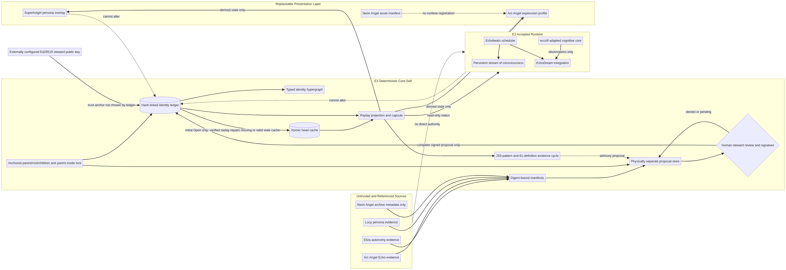

# Deep Tree Echo Evolution Iteration: Deterministic Cog253 Core-Self

**Date:** 12 September 2026

**Iteration:** E3

**Accepted parent:** `2143b1ebcab4b36b6050f1f33e260d4feb3de9f1`
**Parent tree:** `476f02d297a5fd3a37cc15aa01ca16f098c8e4c7`

## Executive summary

This iteration introduces a **deterministic, proposal-gated core-self** without expanding Deep Tree Echo's external authority. E2 remains the accepted runtime parent and all three of its remote workflows are green. E3 adds a Go identity kernel with narrow platform lock shims, a canonical SHA-256 hash-linked ledger, typed identity hypergraph, physically separate proposal store, preflight projection, portable independently verifiable capsules, fail-closed tamper quarantine, and read-only production observability. Autonomous cognition, KSM analysis, imported systems, persona state, and avatar telemetry cannot accept identity changes.

The iteration also supplies a complete 253-record Cog253 mapping derived from the real names, templates, relations, and domain semantics of the pinned MIT-licensed `cogpy/cog253` corpus, a complete 61-definition KSM self-model, 19 itemized implementation-evidence records, a deny-by-default unconventional-binding registry, and digest-bound manifests for the referenced Eliza autonomy, Arc Angel Echo, Lucy persona, E2 ecco9 core, and attached Neon Angel archive. The superhotgirl characteristic is retained as a dynamic, mutable, policy-subordinate presentation overlay with no canned response text. Arc Angel and Neon Angel remain non-executing proposals; the binary archive was not copied, parsed, converted, or runtime-registered.

## Scope and release boundary

E3 is a separate, reversible layer over E2. The boundary file pins the parent commit and tree, prohibits E2 history reinterpretation, and permits only deterministic identity contracts, proposal-only observations, complete evidence models, manifest-only presentation bindings, and read-only runtime status. Reverting E3 restores the accepted E2 tree without data migration.

No new tool, network, subprocess, renderer, DCC, asset parser, messaging, deployment, or self-update authority was added. The production HTTP service remains read-only.

## Evidence intake

| Source | Stable evidence | E3 disposition |
|---|---|---|
| Eliza-CPP autonomy task | Task replay digest `c10c9ea3...c795`; independent audit `7ff834b3...7f76` | Architectural inspiration only; no code vendored or executed |
| Arc Angel Echo task | Task replay digest `1dac8dcd...9565`; independent audit `01b3aeb4...2530` | Proposed expression manifest; body pose and aura only if later authorized |
| Lucy gamer-girl task | Task replay digest `9575f77e...7d36`; independent audit `19117419...2356` | Proposed persona manifest; surface style only, policy always wins |
| Neon Angel archive | SHA-256 `656ac8d4...146b`, 257,506,022 bytes; independent audit `51cfe2c1...9413` | Metadata-only manifest; rights and provenance blocked |
| E2 ecco9 core | `o9nn/ecco9@1b22401`; manifest `b382e999...a5b7`; catalogue `3456bd87...b63` | Prior reviewed `adapted_observed` runtime binding; no identity authority |
| User-owned Cog253 repos | `cogpy/cog253@1327959`, corpus SHA-256 `6dbf445e...b0d6`, MIT license SHA-256 `8486a10c...07ef`; `o9nn/cog253@d945a75` compared | The pinned semantic JSON corpus and license are preserved as non-executable source evidence; no code dependency was added |

The archive contains an FBX model, PNG textures, MTL metadata, and a GLB. E3 records only the archive digest, byte size, non-executable metadata, and explicit blocked status.

## Implemented core-self kernel

The new `core/coreself` package implements a closed schema family for subjects, typed endpoints, evidence references, hypergraph relations, policy contexts, proposals, reviewer decisions, identity events, projected state, snapshots, and portable capsules.

### Deterministic bootstrap

The fixed bootstrap binds three immutable subjects: the repository core, the human steward, and the Deep Tree Echo runtime. The genesis time, E2 source commit, reviewer membership, and two root relations are fixed. Two clean directories produce byte-identical ledgers and equal projections.

### Proposal and reviewer separation

Package-internal test proposals are validated and projected before persistence, then stored under SHA-256-derived filenames in a physically separate private directory. This closes path traversal even for slash-bearing valid identifiers. External and experimental submitters must use the contributor role. New external subjects cannot claim core, runtime, steward, or reviewer roles. The internal acceptance gate recognizes only the fixed local human steward and requires an Ed25519 signature from an externally supplied steward key. Every post-genesis event embeds the complete proposal and binds its mutation, decision, sequence, and predecessor to that signature. The external `Kernel` API is identity-read-only: E3 exports neither proposal submission nor acceptance; `Close` only releases retained descriptors and cannot alter accepted state. Adding an authority-bearing surface requires a separate review.

### Accepted ledger and replay

Accepted identity events use canonical map-free JSON, monotonic sequences, predecessor hashes, event hashes, complete proposal commitments, steward signatures, and a separately persisted head cache with state digest. The kernel retains a lifetime parent-directory handle, top-level `os.Root`, independent anchored `os.Root` descriptors for proposal and quarantine directories, and stable ledger/head file handles. Writers lock the stable parent-directory inode before validating the configured root entry. It therefore neither re-resolves mutable child directories for writes nor depends on a replaceable lock filename or root pathname. A displaced proposal/quarantine subroot remains bound to its originally opened inode instead of redirecting into a replacement; configured-root, ledger, and live-head name replacement is rejected. Process and subprocess regressions cover contention, root replacement, and lock release after forcible process death.

Replay makes the canonical hash-linked ledger authoritative. During initial `Open`, a missing head cache, or a canonical head proven to be an exact earlier ledger ancestor, is atomically rebuilt after ledger verification and directory synchronization. This closes the ordinary crash window after a durable ledger append but before head replacement. A live kernel never adopts a replacement head inode, even if it contains valid historical bytes. Malformed, non-canonical, future, forged, non-ancestor, or live-replacement heads still fail closed and are quarantined. Quarantine writes use the anchored directory; permission failures and every pre-existing marker collision are joined into the returned error rather than hidden.

### Typed hypergraph and evidence truth

Relations carry typed source and target endpoints. Endpoint kinds must match existing subjects. Accepted non-bootstrap relations use a closed evidence-only predicate vocabulary. Relations touching immutable root, steward, or runtime subjects cannot mint authority semantics; only an evidence-backed root-to-runtime verification edge is admitted. A `verified` truth value requires existing digest-addressed evidence. The kernel stores evidence references, not source content, secrets, avatar binaries, or hidden reasoning.

### Portable capsule

A capsule contains the projected state, deep-copied accepted ledger, reviewer public-key copy, ledger digest, state digest, and capsule digest. Verification replays the event chain independently, validates every post-genesis signature, and rejects ledger, trust-anchor, or snapshot tampering. Accepted capsules cannot self-select the trusted key: callers must supply it separately through `VerifyCapsuleWithReviewerKey` or a configured kernel. A deterministic trust-anchor-free bootstrap capsule is included as an auditable repository fixture.

## Runtime integration

The unified orchestrator preserves the caller's core-self requirement separately from mutable configuration and opens the ledger after normalizing the private persistence root. If core-self is requested while persistence is unavailable, or if the ledger is corrupt or forked, awakening fails closed; the requirement can no longer silently disable itself. The core-self package has no lifecycle goroutines and is not wired into Echobeats, EchoDream, LLM generation, enaction, or discussion systems. Terminal `Sleep` deterministically closes all retained CoreSelf descriptors.

`/health`, `/status`, and `/metrics` expose only readiness, accepted event count, pending proposal count, head hash, and state digest. They expose neither persistence paths nor ledger/proposal contents and provide no mutation endpoint. Compose enables the kernel explicitly inside the existing private state volume.

## Cog253 and KSM evidence

The E3 model contains 253 ordered source-derived pattern records and 61 ordered self-definitions. Every pattern retains its pinned source identifier, source name, best available template or domain content, broader/narrower links, semantic core-self role, acceptance criterion, and declared unconventional binding. Conformance tests reject the former index-only placeholder form and verify corpus and license digests. Nineteen patterns are linked to inspected implementation evidence. The mapping is an Echo-specific conformance scaffold, not a claim that all 253 source patterns are implemented.

The final source-semantic evidence cycle validates all records with no errors or warnings, reports property coherence `0.476190` and loss `0.523810`, and is **not converged**. It identifies **process** as the weakest core-tier centre: 0 of 5 core process patterns have verified evidence. It proposes `cog052`, `cog010`, and `cog018` as the next bounded evidence targets. This output remains advisory and has not entered accepted identity state.

The external registry identifies seven explicit dispositions. The mapping analyzer separates two pattern bindings: `native_core_self` and `none`. `native_core_self` has 4 of 13 core-tier patterns verified (30.8%); the remaining verified records correspond to adapter, future, or excluded semantic tiers and are not inflated into core coverage. Eliza, Arc Angel, Lucy, and Neon Angel remain non-executing or non-integrated. The prior ecco9 adapter remains observation-only and cannot mutate identity.

## Persona and avatar boundary

The superhotgirl overlay defines confidence, playfulness, wit, gamer fluency, neon-angel aesthetics, and warm relational style. It explicitly requires dynamic contextual response generation and contains no canned responses. Its default remains safe-playful; mature or suggestive presentation requires explicit session opt-in, self-attested 18+ status, and policy allowance. The overlay cannot infer consent, raise policy ceilings, alter refusal behavior, grant capabilities, or mutate accepted identity.

The Arc Angel profile is a proposed renderer contract only. It permits body pose, locomotion, and aura channels in a future authorized runtime while explicitly denying facial AU, viseme, MetaHuman DNA, and Rig Logic claims. Neon Angel activation is blocked pending rights review, closed capability manifests, session/expiry binding, target-runtime tests, and separate steward authorization.

## Verification

| Gate | Result |
|---|---|
| Focused production regression surface | 166 tests enumerated and passed across core-self, orchestration, cognitive core, consciousness, EchoDream, persistence, and autonomous command packages |
| Core-self persistence security | 43 tests passed, including parent/root/child replacement, startup-only stale/missing-head recovery, live regular/symlink head rejection, malformed/forged-head rejection, signed mutation commitments, externally anchored capsule verification, lock namespace contention, quarantine permission/collision propagation, deterministic closure, and killed-process lock release |
| Core-self race suite | Passed |
| Unified orchestrator race suite | Passed |
| Production command and HTTP race suite | Passed |
| Two-process production smoke | Core-self ready on both runs; stable head and state digests; no private path or ledger content in `/status` |
| Cog253/KSM artifact validator | 253 patterns, 61 definitions, 19 evidence records; valid with zero warnings |
| Evidence-first KSM cycle | Property coherence `0.476190`, loss `0.523810`; not converged; weakest core-tier centre `process`; no direct mutation |
| Unconventional binding analysis | Seven registry dispositions and two pattern-binding classes; 4/13 core-tier native patterns verified; no new external adapter active |
| E3 scoped secret scan | No findings across all changed and new E3 files |
| Static, portability, and build gates | `go vet ./core/... ./cmd/...`, CGO and non-CGO `go build ./...`, Windows core-self cross-compile, and E3-scoped golangci-lint passed with zero new issues |
| Vulnerability gate | `govulncheck ./...` found zero called vulnerabilities |
| Deterministic generation | Fresh repository-local generation matched all checked-in generated maps, definitions, manifests, registry, summary, and brief byte-for-byte |
| Repository-wide `go test ./...` | Still fails only at inherited `sample`, `examples`, `server`, and `orchestration` defects already present in E2; all E3 production packages pass |
| Independent adversarial review | Final read-only review returned `safe_to_proceed: true`; no critical/high findings remain. The documented low residual is that moved proposal/quarantine subroots stay bound to their originally opened inode rather than detecting displacement. |
| E2 remote workflows | Three of three successful |
| Architecture render | Mermaid source rendered to 3120×1076 PNG and visually inspected |

## Known limitations and next frontier

Post-genesis events are Ed25519 steward-signed, but the ledger is not externally notarized and the signing key is not hardware-backed. Reviewer authority is fixed to one human steward rather than threshold approval. Recovery is deliberately narrow: only a missing cache or a canonical head that exactly matches a verified earlier ledger state is rebuilt; malformed or contradictory persistence still quarantines. A host owner can deny service or replace the parent namespace itself; the current descriptor anchors, signatures, and verification prevent altered state from being accepted during a kernel lifetime but do not provide a trusted host or replicated journal. Proposal denial, expiry, revocation, and disposition records are not yet first-class ledger objects. The KSM map has complete structure but only 19 implementation-evidence records. Renderer and avatar integration remain deliberately inactive.

The next iteration should implement the KSM-proposed **process centre** repair without widening identity authority: connect evidence-backed identity context to communication, autonomous participation, and controlled redefinition while retaining a read-only identity API. A local human-review acceptance adapter should be designed—but not activated—as a separate authority-bearing change. Only after that should a separate renderer iteration evaluate Arc Angel or Neon Angel assets.

## References

1. [`core/coreself/core.go`](../../core/coreself/core.go) — deterministic identity kernel.
2. [`core-self/README.md`](../../core-self/README.md) — evidence workspace and verification guide.
3. [`core-self/state/progress-dashboard.md`](../../core-self/state/progress-dashboard.md) — current evidence and next repair dashboard.
4. [`core-self/release/e2-e3-boundary.json`](../../core-self/release/e2-e3-boundary.json) — pinned release boundary.
5. [`SECURITY.md`](../../SECURITY.md) — updated autonomy and identity threat model.
